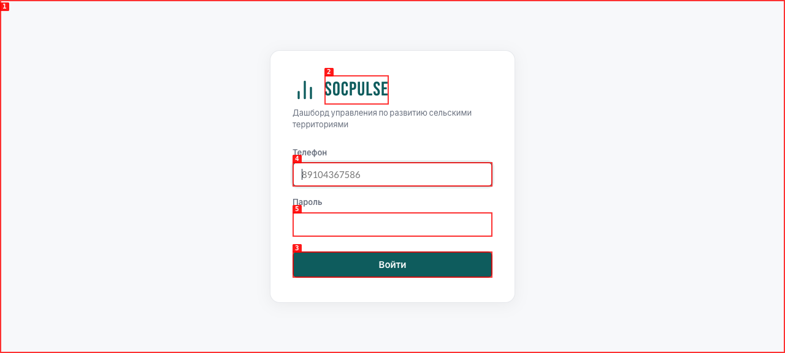
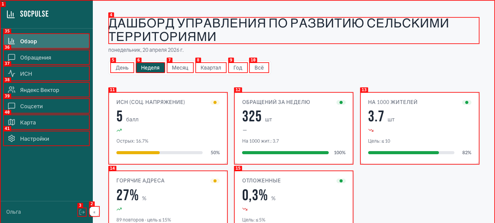
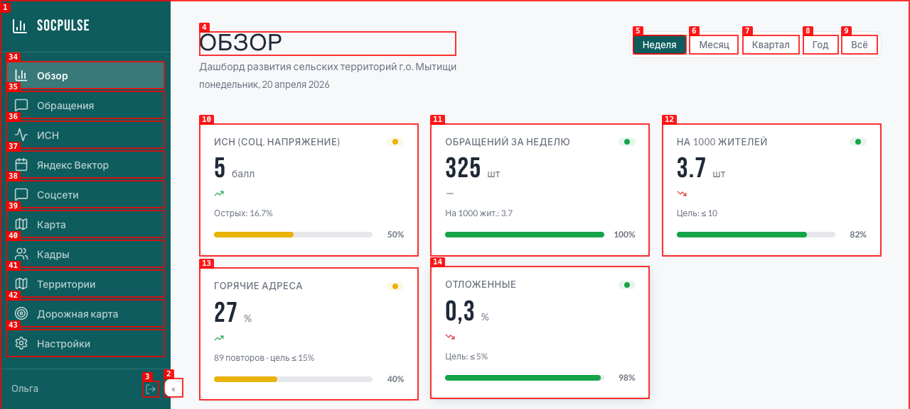
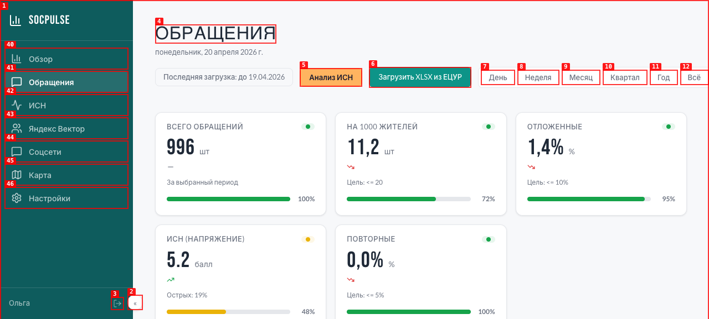
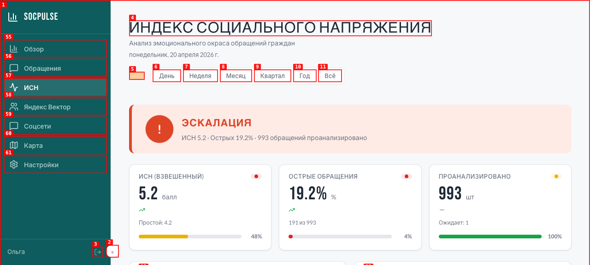
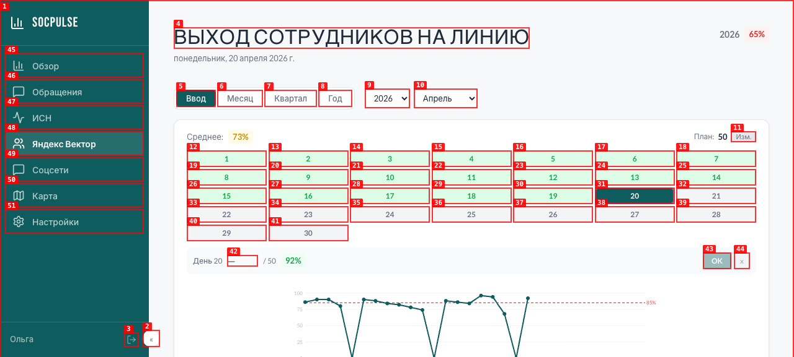
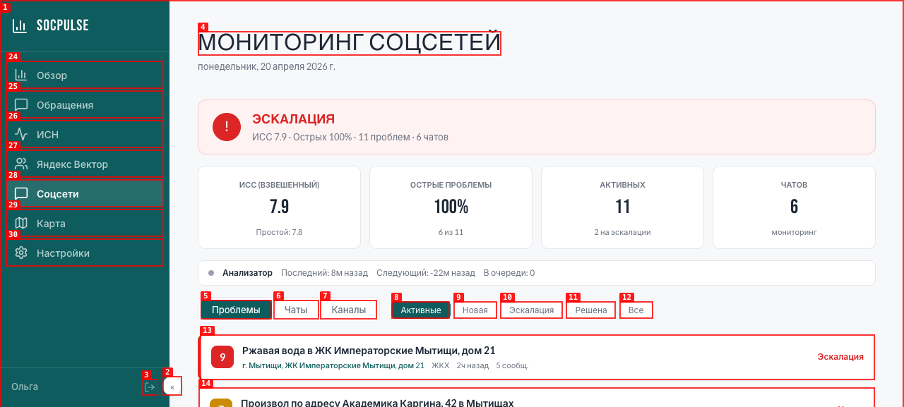
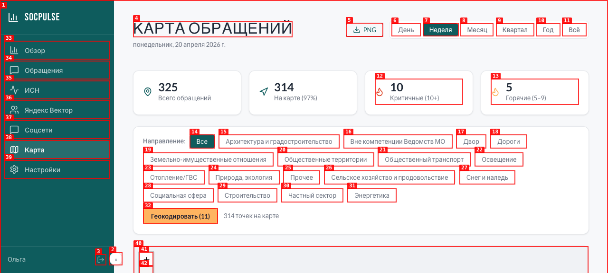
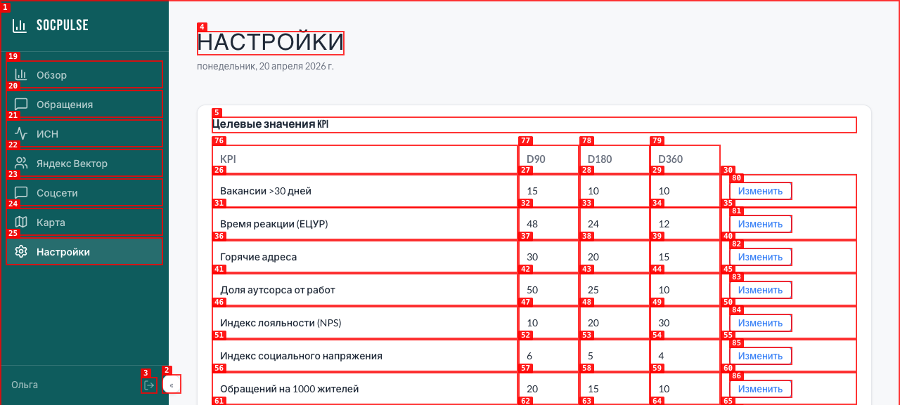
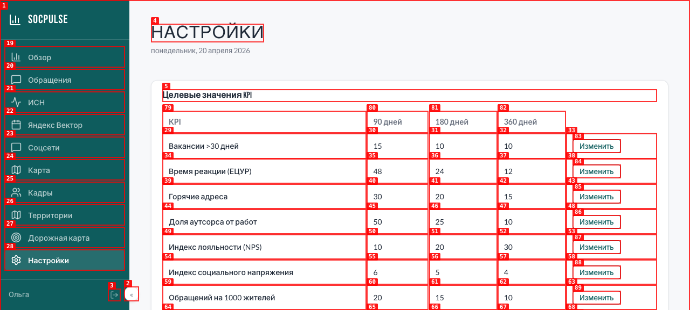

# Design Brief — KPI Dashboard SocPulse (редизайн)

**Цель:** полный визуальный редизайн внутреннего управленческого портала с "сырого" состояния (14/24 по 6-пиллар аудиту) до современного production-grade уровня. Сохранить текущую IA и бэкенд, переосмыслить всю визуальную систему.

---

## 1. Контекст продукта

### Что это
Внутренний оперативный портал для руководства **МБУ "Мытищинский техкомплекс"** и профильных ведомств городского округа Мытищи. Одно рабочее место руководителя, куда стекаются:
- обращения граждан (из ЕЦУР, Добродел, импорт XLSX)
- результаты анализа Telegram-каналов/чатов (тональность, острые темы)
- сводный индекс социального напряжения (ИСН)
- посещаемость сотрудников (интеграция с Яндекс Вектор)
- географическая визуализация (тепловая карта обращений)
- целевые значения KPI и их исполнение

### Кто пользователь
- **Руководство** — зам главы администрации, главы ведомств. Мало времени, читают сводки на утренних планёрках. Нужна "боль сразу в глаз".
- **Начальники отделов** — копают в конкретные обращения/чаты. Нужна возможность быстро дрилл-дауна.
- **Оператор** — заносит данные, импортирует XLSX, меняет KPI-цели.

Все трое — **один человек может носить все шляпы**. Role-based UI пока out-of-scope.

### Язык и локаль
- UI полностью на русском. Современный канцелярский тон, **без бюрократизма** (не "г.", не "ув." и т.п.)
- Числа с запятой как десятичный разделитель (1,4% а не 1.4%)
- Даты: "20 апреля" / "20 апр" / "понедельник, 20 апреля"

### Технические рамки (незыблемо)
- **Стек:** React 19 + Vite + TypeScript + **CSS Modules** (никакого Tailwind / MUI / Chakra)
- **Backend:** Supabase — редизайн его не трогает
- **Хостинг:** один VPS, SPA, `socpulse.ru`
- **Иконки:** lucide-react (уже подключён) — можно расширять, но предпочтительно одно семейство
- **Шрифты:** текущий выбор — Bebas Neue (headings) + Lato/Inter (body) + JetBrains Mono. Можно менять, но предложить замену с обоснованием
- **Никакой мобильный нативный app** — только web, но мобильный/tablet **responsive обязателен** (сейчас сломан)

---

## 2. Текущее состояние — что болит

### Оценка 6-пиллар аудита (1-4, максимум 24)
| Пиллар | Текущая | Проблемы |
|---|---|---|
| Copywriting | 3 | Лейблы в целом ок, но "Изм.", "x", "OK", устаревшее "г." |
| Visuals | 2 | Иконки непоследовательны, нет illustration, SVG charts без aria |
| Color | 2 | Broken token system — `--color-primary` использовался но не был объявлен, давал синий фолбэк на Settings и Roadmap |
| Typography | 2 | 13 разных размеров от 8px до 32px без явной шкалы, heading-шрифт применён неравномерно |
| Spacing | 3 | Секции 24px стабильно; внутри — 6/8/10/12/16 без шкалы |
| Experience | 2 | Mobile реально сломан на Sidebar-уровне, 4 aria-label на весь кодбейс, нет confirm-диалогов для destructive actions |

**Итог: 14/24.** Подробности: `.planning/UI-REVIEW.md`.

### Баги из прод-догфуда (socpulse.ru)
12 проблем задокументированы в `.planning/dogfood/report.md`. 10 из них уже починены tactical-патчами в коммитах `0e4ce38`/`6a218a4`. **Системные** проблемы (типографика, spacing, consistency) остались — это задача редизайна.

### Что уже работает и НЕ надо трогать логически (только визуально освежить)
- Авторизация работает
- KPI-карточки как паттерн (value + unit + trend + progress + badge)
- Filter-панели на Appeals/HeatMap (по направлениям, датам)
- Slide-over для детали обращения
- Escalation banner на ISN и SocialMonitor
- Table-паттерн на Settings (KPI-цели)

---

## 3. Цели редизайна

### Приоритеты (в порядке важности)
1. **Data-first** — цифра и её контекст главнее декорации. Руководитель должен увидеть "норма/тревога" за 2 секунды.
2. **Trust** — это инструмент для принятия управленческих решений. Должно выглядеть как про-продукт, а не как прототип.
3. **Density без перегруза** — у пользователя 8 экранов, на каждом десятки метрик. Нужна железная иерархия.
4. **Мобильный parity** — просмотр на iPad/телефоне на выездах обязателен; сейчас откровенно падает.
5. **Accessibility минимум AA** — это не marketing сайт, это рабочий инструмент; госсектор ожидает доступности.

### Тон бренда
- **Серьёзно, без игривости** (не стартапный стиль с большими цифрами и градиентами)
- **Современный** — близко к дизайну Linear / Vercel dashboard / Height.app, но не буквальная копия
- **Российский госсектор — но новое поколение** — референс: Госуслуги редизайн 2023+, Яндекс Про
- **Teal как primary** (`#0E5C5D` уже зафиксирован в токенах) — неон/розовый/янтарь в декоре не нужны

---

## 4. Объём — страницы в скоупе

После удаления Staff/Territories/Roadmap осталось **8 страниц**:

| № | Страница | URL | Роль |
|---|---|---|---|
| 1 | Login | `/login` | Вход; принимает телефон или email |
| 2 | Overview | `/` | Главная; агрегированный взгляд по всем доменам |
| 3 | Appeals (Обращения) | `/appeals` | Реестр обращений граждан с фильтрами и импортом |
| 4 | KpiDetail | `/kpi` | Drill-down в конкретный KPI с историей |
| 5 | ISN (Индекс соц. напряжения) | `/isn` | Аналитика тональности обращений |
| 6 | Attendance (Яндекс Вектор) | `/attendance` | Календарный трекинг выхода сотрудников на линию |
| 7 | SocialMonitor (Соцсети) | `/social` | Мониторинг Telegram-чатов и каналов |
| 8 | HeatMap (Карта) | `/map` | Геопривязка обращений, тепловая карта района |
| 9 | Settings (Настройки) | `/settings` | KPI-цели, список чатов для мониторинга, feature-flags |

Плюс три shared-уровня:
- **Sidebar navigation** (collapsed / expanded states)
- **Page Header** (title + subtitle + date + actions + filters)
- **Shared components library** (см. раздел 6)

---

## 5. Поток информации (IA, которую НЕ надо ломать)

```
Sidebar (постоянный): Обзор / Обращения / ИСН / Яндекс Вектор / Соцсети / Карта / Настройки
            |
     Page Header: H1 + subtitle + [filters / actions]
            |
     Content area: KPI-карточки → Charts → Tables / Lists / Slide-over детали
```

Пользователь почти всегда начинает с Overview, оттуда расходится в конкретные разделы. Drill-down из KPI-карточки → KpiDetail или в соответствующий раздел.

---

## 6. Дизайн-система — что нужно спроектировать

### 6.1 Токены (обязательно)

```
Цвет:
  brand-primary      teal    #0E5C5D  (уже зафиксирован)
  brand-primary-soft         #BBDFD3
  brand-accent       orange  #FFB460  (для "pending action" — Анализ ИСН, Геокодирование)
  brand-warning      yellow  #EAB308
  brand-danger       red     #DD4526
  brand-success      green   #16A34A

  surface-0          #F7F8FA   (фон страницы)
  surface-1          #FFFFFF   (карточки)
  surface-2          #EFF2F7   (hover, пресс-state)
  border             #E5E7EB
  text-primary       #1F2937
  text-secondary     #6B7280
  text-tertiary      #9CA3AF

Типографика:
  font-heading  — выбрать: либо Bebas Neue (нынешний), либо сменить на Manrope / Inter bold
  font-body     — Inter / Lato (одно)
  font-mono     — JetBrains Mono или SF Mono

  Размеры (предложить шкалу) — макс 6-7 размеров от 11 до 32-36px
  Веса: 400 / 500 / 600 / 700

Spacing (4px/8px шкала, обязательно явная):
  space-1 = 4px
  space-2 = 8px
  space-3 = 12px
  space-4 = 16px
  space-5 = 24px
  space-6 = 32px
  space-7 = 48px
  space-8 = 64px

Радиусы:
  radius-sm = 4px   (badge)
  radius-md = 8px   (input, button)
  radius-lg = 12px  (card)
  radius-xl = 16px  (modal, slideover)

Тени:
  shadow-sm для карточек
  shadow-md для hover
  shadow-lg для модалей
```

### 6.2 Компоненты — редизайн существующих

| Компонент | Путь | Что важно |
|---|---|---|
| KpiCard | `src/shared/ui/KpiCard/` | Ключевой — используется везде. Должен нести: label / value+unit / delta trend / progress / status badge / optional target. Предусмотреть compact и expanded режимы, clickable state |
| Card | `src/shared/ui/Card/` | Базовый контейнер — унифицировать padding/radius/shadow |
| Badge | `src/shared/ui/Badge/` | Статусные бейджи — green/yellow/red/neutral + variants по роли |
| Sidebar | `src/shared/ui/Sidebar/` | Collapsed (icon-only) + expanded — критичный мобильный кейс (сейчас сломан) |
| Header | `src/shared/ui/Header/` | Title + subtitle + date + right-slot для actions/filters |
| DateRangePicker | `src/shared/ui/DateRangePicker/` | Пресеты — Неделя/Месяц/Квартал/Год/Всё. Добавить custom range |
| DataTable | `src/shared/ui/DataTable/` | Сорт, фильтр, пагинация. Используется на Appeals и Settings |
| SlideOver | `src/shared/ui/SlideOver/` | Боковая панель детали — в проекте критичный UX-паттерн |
| EmptyState | `src/shared/ui/EmptyState/` | Пустое состояние с CTA |
| Skeleton | `src/shared/ui/Skeleton/` | Loading-плейсхолдеры — расширить варианты |
| Toast | `src/shared/ui/Toast/` | Notifications — позиция bottom-right, stack |
| Chart | `src/shared/ui/Chart/` | Кастомный SVG. 6 типов: bar, line, area, radar, horizontal-bar, donut. Унифицировать цвет/axis/tooltip |
| ProgressBar | `src/shared/ui/ProgressBar/` | Показывается на KpiCard — тонкий (4-6px) |

### 6.3 Новые компоненты (чего сейчас нет)

- `ConfirmDialog` — для destructive actions (сейчас везде inline)
- `FilterGroup` — унифицированная группа pill-фильтров (сейчас на HeatMap 16 pills в 4 ряда, ужасно)
- `MetricCard` — вариант карточки для крупных summary (аналог больших чисел в Overview/SocialMonitor)
- `EscalationBanner` — красная шапка "тревога" (сейчас кастомная на ISN и SocialMonitor)
- `InlineEdit` — для Attendance/Settings inline-редактирование
- `PhoneInput` — с нормализацией +7/8 автоматически
- `ScoreCircle` — цветной кружок балла 1-10 (используется в ISN и SocialMonitor как issue-severity)

### 6.4 Компоненты-кандидаты на удаление
- Кастомный SVG Chart можно рассмотреть замену на **Recharts** / **visx** если это удешевит поддержку — проверьте с инженером

---

## 7. Страница за страницей — что должен сделать дизайнер

> **Скриншоты текущего состояния** лежат в `dogfood/screenshots/` (относительно этого файла). Снято с прод `socpulse.ru` при догфуд-тесте 2026-04-20, **до** тактических фиксов. Некоторые UX-баги с этих скринов уже починены в коммитах `0e4ce38` / `6a218a4`, но композиция/иерархия/типо — всё ещё исходные.

### 7.1 Login


- Приём `+79XXXXXXXXXX` или email — placeholder нормализации готов
- Минималистичный: логотип + одна форма + пояснение "для сотрудников МБУ МТХ"
- Error-state визуально распознаваемый (сейчас просто красный текст)

### 7.2 Overview — главная



**Сейчас:** 5 KPI-карточек → 3 больших графика → список "Горячих адресов".
**Надо:**
- Иерархия: самый важный элемент должен читаться за 1 секунду ("что сегодня самое плохое?")
- Escalation banner если ИСН / острота пересекли порог
- KPI-ряд cleaner: без double-%
- Карта и список "горячих" адресов — возможно слить в один блок
- Чёткие entry points в остальные разделы

### 7.3 Appeals


**Сейчас:** 2 CTA (Анализ ИСН + XLSX import), KPI-ряд, 2 графика, таблица с фильтрами.
**Надо:**
- Фильтры направления компактнее (сейчас занимают много вертикали на HeatMap)
- Таблица с sticky header и per-row click → slide-over
- Badge для статуса обращения
- Возможность bulk-actions (отметить как проверенные)

### 7.4 KpiDetail
_Скриншот не сделан в dogfood-проходе (страница доступна drill-down кликом с Overview)._

**Сейчас:** Выбор KPI + график + таблица значений.
**Надо:**
- Period comparator (этот период vs прошлый)
- Clear target visualisation (горизонтальная линия на графике)
- Annotations (интервенции / события)

### 7.5 ISN


**Сейчас:** Traffic-light banner + 3 KPI-карточки + распределение баллов + топ-обращения по баллу.
**Надо:**
- Distribution histogram как якорь страницы
- Critical appeals list с прямой копией в Telegram (кнопка есть — улучшить визуал)
- Weekly trend chart — проще читается

### 7.6 Attendance (Яндекс Вектор)


**Сейчас:** Calendar grid с inline edit + chart снизу.
**Надо:**
- Calendar с tooltip по дням (не только цвет)
- Inline edit без кнопок OK/x — или хотя бы нормальные лейблы (уже починено tactically)
- Plan / факт comparison виднее

### 7.7 SocialMonitor


**Сейчас:** Escalation banner + 4 карточки + статус анализатора + 3 таба (Проблемы/Чаты/Каналы).
**Надо:**
- Статус анализатора как нормальный health-indicator (сейчас просто текст)
- Issue card compact: severity score кружком, title, source chat, time
- Channel news с embed preview (картинка + текст)
- Action "Копировать для Telegram" — primary CTA на каждом острой проблеме

### 7.8 HeatMap


**Сейчас:** KPI-ряд + filter pills + Leaflet map + Export PNG.
**Надо:**
- Filter pills → collapsed multi-select
- Full-bleed карта (сейчас сжата под header)
- Legend видимая, с числами
- Hotspot list сбоку синхронизирован с картой (hover на item → panning на карте)

### 7.9 Settings



**Сейчас:** Table с KPI-целями + список Telegram-чатов + feature flags.
**Надо:**
- Разделить на таб/секции (KPI / Чаты / Флаги / Прокси для бота)
- Inline edit с optimistic update
- Диалог подтверждения для delete-чата

---

## 8. Адаптив — требования по breakpoints

```
Mobile     ≤ 640px   один столбец; sidebar как bottom-sheet drawer
Tablet     641-1024  двухколоночный на Overview; sidebar компактный
Desktop    1025-1440 3 KPI-карточки в ряд (как сейчас)
Wide       1441+     4 KPI-карточки / более плотная сетка
```

Сейчас mobile реально падает — sidebar не коллапсится правильно, KPI-карточки переполняют контейнер.

---

## 9. Accessibility требования

- Минимум WCAG **AA** для всех текстов (контраст ≥ 4.5:1)
- Все интерактивные элементы имеют `aria-label` или видимый лейбл (сейчас почти ничего не имеет)
- Focus visible state для клавиатуры
- SVG-графики: `<title>` и `<desc>` для screen reader, `role="img"`
- Цвет не единственный носитель статуса (если "красный/жёлтый/зелёный" — добавить иконку или текст)

---

## 10. Ожидаемые deliverables

От дизайнера ждём:

### A. Design tokens (CSS custom properties)
- Полный файл `src/index.css` с переменными — готовый к замене текущего
- Документ в Figma с визуальной сводкой цветов/типографики/spacing/тени

### B. Компоненты
- Figma-файл с всеми компонентами из списка (6.2 + 6.3) во всех состояниях: default / hover / active / disabled / focused / loading / error
- Рекомендации какие props должны быть (без TypeScript-типов, описание)

### C. Страницы
- 8 страниц × 3 breakpoints (Mobile / Tablet / Desktop) = 24 макета
- Крайние состояния для каждой страницы: empty / loading / error / full-of-data

### D. Motion & interactions
- Краткое описание микровзаимодействий: hover transitions, loading, toast появление, slide-over motion
- Не нужно prototype — текстовое описание + timing значения в ms

### E. Передача
- 1 короткий handoff-документ (5-10 страниц) с ключевыми принципами + ссылками на Figma
- Экспорт иконок (если кастомные) в SVG
- Список рекомендаций по замене/добавлению в `lucide-react` иконки

### F. Необязательно, но полезно
- Mood board / inspiration collage (2-3 референса вроде Linear, Datadog Dashboard, Госуслуги 2.0, Monday.com, Notion)
- Наблюдения по структуре информации — если в какой-то странице иерархия "плоская", предложить реорганизацию

---

## 11. Out of scope для этого редизайна

- Изменение бизнес-логики / data-модели (Supabase schema)
- Новые фичи (Social Health Index per settlement — отдельный проект)
- Замена стека (React / CSS Modules остаются)
- Мульти-язычность (только RU)
- Native mobile app
- Иллюстрации кастомные (упрощение до иконок + текстовых пустых состояний ок)

---

## 12. Процесс

Предлагаемый flow:
1. **Discovery (1-2 дня)** — дизайнер читает этот бриф + UI-REVIEW + dogfood-report, заходит на socpulse.ru (тестовый аккаунт выдать отдельно), смотрит все 8 страниц вживую. Возвращается с уточняющими вопросами и mood-board.
2. **Foundation (3-4 дня)** — дизайн-токены + базовые компоненты (Card, Button, KpiCard, Badge, Header, Sidebar). Согласуем прежде чем идти в страницы.
3. **Pages (5-7 дней)** — 8 страниц × 3 breakpoints. Желательно итеративно — сначала Overview + одна сложная (ISN или SocialMonitor), потом остальные.
4. **Review (1-2 дня)** — просмотр вместе с инженером и владельцем, правки.
5. **Handoff (1 день)** — документация, экспорты.

Итого: **~2 недели** для полной редизайн-итерации.

---

## 13. Контекстные файлы для дизайнера

Обязательно прочитать перед стартом:
- `.planning/PROJECT.md` — что за продукт, кто пользователь
- `.planning/UI-REVIEW.md` — куда копать по 6 пилларам
- `.planning/dogfood/report.md` — конкретные баги и UX-ямы которые видели на прод (скриншоты в `.planning/dogfood/screenshots/`)
- `.planning/codebase/ARCHITECTURE.md` — как устроен frontend (чтобы не предлагать то что стек не вывезет)
- `.planning/codebase/STRUCTURE.md` — где какие компоненты лежат

Тест-доступ на прод (`https://socpulse.ru`) — запросить у владельца. Там реальные данные, можно видеть density.

---

## 14. Что считаем успехом

- Оценка по тем же 6 пилларам **≥ 21/24** при повторном аудите
- Mobile действительно работает (Sidebar не ломается, KPI-карточки стакаются)
- Brand-нарушений нет (нет синих Tailwind-fallback кнопок)
- WCAG AA проходит (контраст, aria-label)
- Руководитель во время первого просмотра говорит "вот это другое дело"
